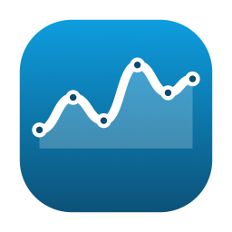
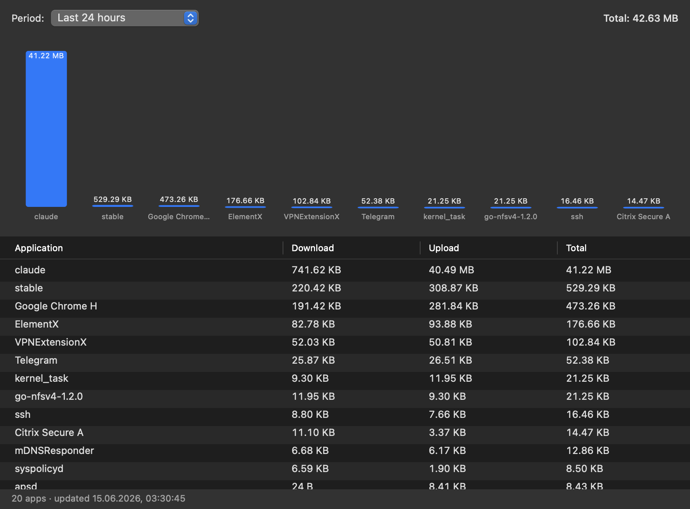

<p align="center">
  
</p>

# apptraf

> **Where is your bandwidth going?**
> A native macOS background agent that records per-app network traffic, hour by hour, for the last 7 days — at ~3 MB RSS and 0 % CPU.

[](LICENSE)
[](https://github.com/hexstyle/apptraf/releases)
[](#)
[](https://swift.org)
[](#install)
[](https://github.com/hexstyle/apptraf/stargazers)



---

## Why apptraf

- **It's actually lightweight.** ~3 MB RSS, ~0 % CPU, one wake-up per minute. No system extension, no kernel module, no network filter — just a tiny user-level process polling `nettop`.
- **One command to install.** `brew install` + `brew services start`. Done.
- **Self-healing background service.** Installed as a `launchd` agent with `KeepAlive=true` — if it dies, launchd brings it back within seconds.
- **7-day history with hourly resolution.** Not "since this process started." Not "what happens now if I open this app." A full week of granular data, by app.
- **Zero telemetry, zero network calls.** apptraf doesn't talk to anything but your local SQLite file.
- **Native AppKit UI.** No Electron. No Chromium. No SwiftUI overhead. The window opens instantly and uses ~60 MB only while it's on screen.
- **Open source, MIT.** Read the ~700 lines of Swift, audit it, fork it.

## Install

```sh
brew tap hexstyle/apptraf https://github.com/hexstyle/apptraf
brew install hexstyle/apptraf/apptraf
brew services start hexstyle/apptraf/apptraf
```

After install, drop `AppTraf.app` into `/Applications` once with the bundled helper (re-run it after every `brew upgrade` to keep the copy in sync):

```sh
apptraf-install-app
```

That makes AppTraf show up in Spotlight, Launchpad, Finder and the Dock. Or just open the UI from any terminal:

```sh
apptraf
```

The daemon needs the first ~2 minutes of uptime to establish per-process baselines; after that, every minute of traffic shows up in the current-hour bucket.

> Why a copy and not a symlink? Spotlight reliably indexes only bundles physically present under `/Applications`; symlinks into `/opt/homebrew/...` aren't indexed. The helper does a `cp -R` + `lsregister -f` and refuses to clobber a non-AppTraf bundle at the target path.

> Homebrew 6+ asks you to trust new taps. If the install errors out, run
> `brew trust --formula hexstyle/apptraf/apptraf` once.
> Requires Xcode Command Line Tools (`xcode-select --install`).

## Resource footprint (measured, not promised)

| Metric                          | Value         | How it's measured                    |
|---------------------------------|--------------:|--------------------------------------|
| Daemon resident memory (RSS)    |   **3.1 MB**  | `ps -o rss` after 10 min runtime     |
| Daemon CPU (idle)               |    **0.0 %**  | `ps -o %cpu` between samples         |
| Wake-ups per minute             |        **1**  | sample loop interval = 60 s          |
| Time per sample cycle           |  **~20–30 ms**| `nettop` call + SQLite write         |
| Active duty cycle               | **~0.05 %**   | 30 ms work every 60 000 ms           |
| Disk: empty DB                  |    **24 KB**  | fresh install                        |
| Disk: projected 7-day full DB   |   **<1 MB**   | ~20 apps × 168 h × ~50 B/row         |
| Disk writes per minute          |  **1 txn**    | WAL mode, periodic checkpoint        |
| Outbound network traffic        |     **0 B**   | no telemetry, no update checks       |
| UI memory (while window open)   |   **~60 MB**  | AppKit + chart redraw                |

Run [`docs/bench.sh`](docs/bench.sh) to reproduce every number above on your own machine. Numbers measured on macOS 15.7, Apple silicon.

For comparison, mainstream firewall-style alternatives (Little Snitch, TripMode) sit on Apple's Network Extension framework and run a per-flow content filter. That's the right design for blocking; it's overkill if you just want to *see* where your bytes went.

## Features

- Period selector: last 1 h / 6 h / 24 h / 7 d.
- Sorted table: download / upload / total per app.
- Bar chart of top 10 apps for the selected period.
- Auto-refresh every 30 seconds while the window is open.

## How it works

```
                   every 60 s
   ┌───────────┐   ┌────────────┐   ┌─────────────────┐   ┌────────────┐
   │ apptrafd  │──▶│  nettop    │──▶│ per-pid delta   │──▶│  SQLite    │
   │ (launchd) │   │ (bundled)  │   │ accounting      │   │  (WAL)     │
   └───────────┘   └────────────┘   └─────────────────┘   └─────┬──────┘
                                                                │
                              ┌─────────────────────┐           │
                              │ apptraf (AppKit UI) │◀──────────┘
                              └─────────────────────┘
                              read-only, on demand
```

`nettop -P -L 1 -J bytes_in,bytes_out -x` gives cumulative byte counters per process. The daemon stores the last seen value per `(pid, app)` and computes `delta = current - last` every minute. Deltas accumulate into the current-hour bucket in the `samples` table. Process state older than 5 minutes is evicted (process assumed gone); sample rows older than 7 days are purged.

Data lives at `~/Library/Application Support/AppTraf/data.sqlite`.

## Honest limitations

- **Helpers roll up under the parent app.** Full process paths are resolved via `proc_pidpath`, then aggregated by the outermost `.app` bundle. So all five `Google Chrome Helper` processes show up under one row, `Google Chrome`. Usually what you want.
- **User-level visibility.** apptraf runs as a per-user LaunchAgent — no root, no privileged install. It sees all your apps and most background services. Some root daemons may be partially missing. This is intentional.
- **Per-minute resolution.** A process that lives less than ~60 seconds may be missed entirely. For shells, build scripts and other ephemeral tools this is usually fine; for studying short-lived spikes it isn't.

## Update / uninstall

```sh
# update
brew update && brew upgrade apptraf
apptraf-install-app                       # refresh the /Applications copy
brew services restart hexstyle/apptraf/apptraf

# uninstall
brew services stop hexstyle/apptraf/apptraf
brew uninstall apptraf
brew untap hexstyle/apptraf
rm -rf /Applications/AppTraf.app
rm -rf ~/Library/Application\ Support/AppTraf
```

## Build from source

```sh
git clone https://github.com/hexstyle/apptraf
cd apptraf
scripts/build-app.sh 0.1.2-dev    # produces .build/release/AppTraf.app
.build/release/apptrafd            # foreground daemon, Ctrl-C to stop
open .build/release/AppTraf.app    # opens the UI
```

Regenerate the icon from source: `swift scripts/make-icon.swift && iconutil -c icns Resources/AppTraf.iconset -o Resources/AppTraf.icns`.

Requires Xcode Command Line Tools.

## License

MIT — see [LICENSE](LICENSE). Contributions welcome.
